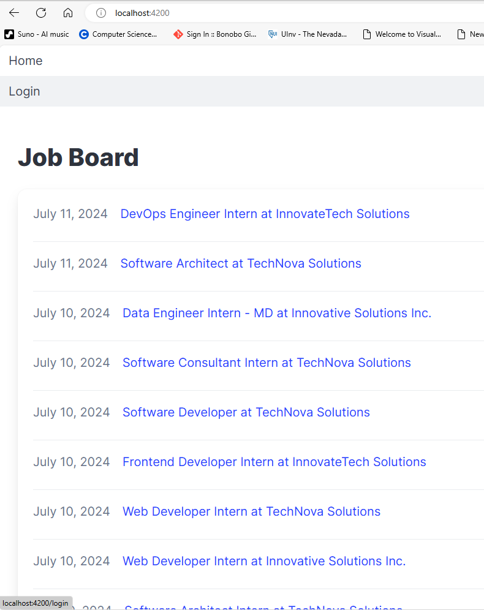

# Job Board demo site

For a live demo visit [job-board.eduardofd.dev](https://job-board.eduardofd.dev)

The site uses synthetic job posts data generated via ChatGPT API. For more details see the ```localhost:9001/generate/jobs``` API endpoint ot the method below.

```typescript
export async function generateJobs(req: Request, res: Response) {
    ....
}
```

The first time the user logs in using google credentials, a company name and description are generated using a LLM. 

Frontend **(Angular 18, OAuth2)**
Backend **(NodeJS, Express, GraphQL, LangChain)**

# To run the project

```bash

## Frontend

cd client-angular
npm install
npm run dev

## Backend

cd server
npm install
npm run dev

```

